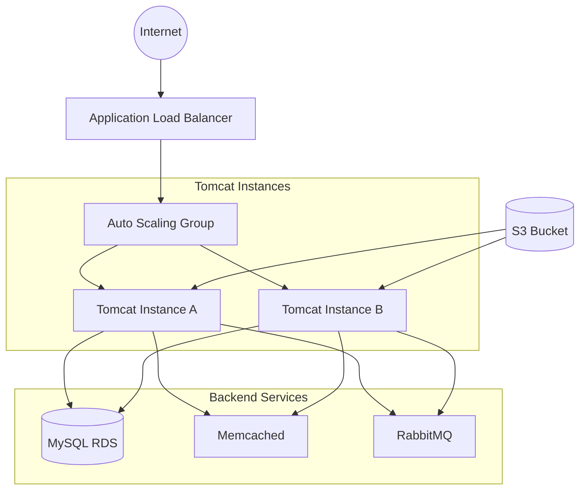

# Java Application AWS Migration Project

## Table of Contents
- [Overview](#overview)
- [Architecture](#architecture)
- [Tech Stack](#tech-stack)
- [Prerequisites](#prerequisites)
- [Infrastructure Components](#infrastructure-components)
- [Implementation Steps](#implementation-steps)
- [Security Setup](#security-setup)
- [Deployment Process](#deployment-process)
- [Configuration Details](#configuration-details)
- [Challenges & Solutions](#challenges--solutions)
- [Monitoring & Maintenance](#monitoring--maintenance)


## Overview

This project demonstrates the successful migration of a Java application to AWS using a lift & shift strategy. The implementation includes high availability setup, security configurations, and automated deployment processes.

## Architecture



## Tech Stack

### Infrastructure
- **Cloud Platform**: AWS
- **Compute**: EC2 (Linux 2023 AMI, Ubuntu)
- **Database**: MySQL (RDS)
- **Caching**: Memcached
- **Message Queue**: RabbitMQ
- **Load Balancer**: Application Load Balancer (ALB)
- **DNS & SSL**: Route 53, ACM
- **Storage**: S3

### Application
- **Runtime**: Java
- **Application Server**: Tomcat 10
- **Build Tool**: Maven
- **Version Control**: Git
- **CLI**: AWS CLI

## Prerequisites

1. AWS Account with appropriate permissions
2. AWS CLI installed and configured
3. Maven installed locally
4. Git Bash or similar terminal
5. Domain (GoDaddy in this case)

## Infrastructure Components

### Instance Specifications
| Service | AMI | Instance Type | Purpose |
|---------|-----|---------------|----------|
| Tomcat | Ubuntu Latest | t2.micro | Application Server |
| MySQL | Amazon Linux 2023 | t2.micro | Database Server |
| Memcached | Amazon Linux 2023 | t2.micro | Caching Server |
| RabbitMQ | Amazon Linux 2023 | t2.micro | Message Queue |

### Auto Scaling Configuration
- **Minimum**: 1 instance
- **Desired**: 2 instances
- **Maximum**: 5 instances
- **Health Check**: ELB
- **Cooldown Period**: 300 seconds

## Implementation Steps

1. **Security Setup**
   - Created Security Groups for ELB, Tomcat, and backend services
   - Generated key pairs for SSH access
   - Configured IAM roles and users

2. **Instance Provisioning**
   - Launched backend instances (MySQL, Memcached, RabbitMQ) using Amazon Linux 2023
   - Created Tomcat instance using Ubuntu AMI
   - Applied User Data scripts (available in `/scripts` directory)

3. **Auto Scaling Configuration**
   - Created AMI from configured Tomcat instance
   - Set up Launch Template
   - Configured Auto Scaling Group

4. **Application Deployment**
   ```bash
   # Build artifact
   mvn clean install
   
   # Upload to S3
   aws s3 cp target/application.war s3://my-artifact-bucket/
   ```

5. **SSL Configuration**
   - Imported SSL certificate using AWS ACM
   - Connected GoDaddy domain
   - Attached certificate to ALB

## Security Setup

### Security Groups Configuration
1. **ELB Security Group**
   - Inbound: 443 (HTTPS)
   - Outbound: 8080 to Tomcat SG

2. **Tomcat Security Group**
   - Inbound: 8080 from ELB SG
   - Outbound: All to Backend SG

3. **Backend Security Group**
   - Inbound: Specific ports from Tomcat SG
   - Outbound: VPC internal only

## Deployment Process

1. Create IAM user for deployment
2. Configure AWS CLI with credentials
3. Build application using Maven
4. Upload artifact to S3
5. Configure instance IAM role for S3 access
6. Deploy to `/var/lib/tomcat/webapps/`

## Configuration Details

### Instance User Data
- Located in `/scripts` directory
- Customized for each service
- Automated installation and configuration

### Application Configuration
- Source code in `/application` directory
- Environment-specific configurations
- Database connection details

## Challenges & Solutions

1. **RabbitMQ User Provisioning**
   - **Issue**: Failed automatic user creation
   - **Solution**: Manual SSH and user creation
   ```bash
   rabbitmqctl add_user myapp mypassword
   rabbitmqctl set_permissions -p / myapp ".*" ".*" ".*"
   ```

2. **Tomcat Installation**
   - **Challenge**: Service configuration on different AMIs
   - **Solution**: Used Ubuntu for simplified Tomcat 10 installation

## Monitoring & Maintenance

1. **Health Checks**
   - ALB health checks on port 8080
   - Auto Scaling Group monitoring

2. **Backup Strategy**
   - RDS automated backups
   - S3 versioning for artifacts

3. **Scaling Policies**
   - CPU utilization-based scaling
   - Network I/O monitoring

## Future Improvements
- [ ] Container migration (ECS/EKS)
- [ ] CI/CD pipeline implementation
- [ ] Enhanced monitoring setup
- [ ] Disaster recovery planning

---

## Contributing


## License

